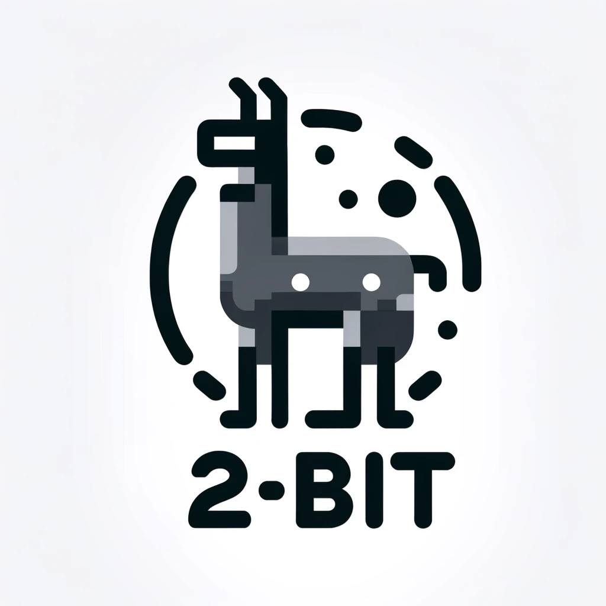
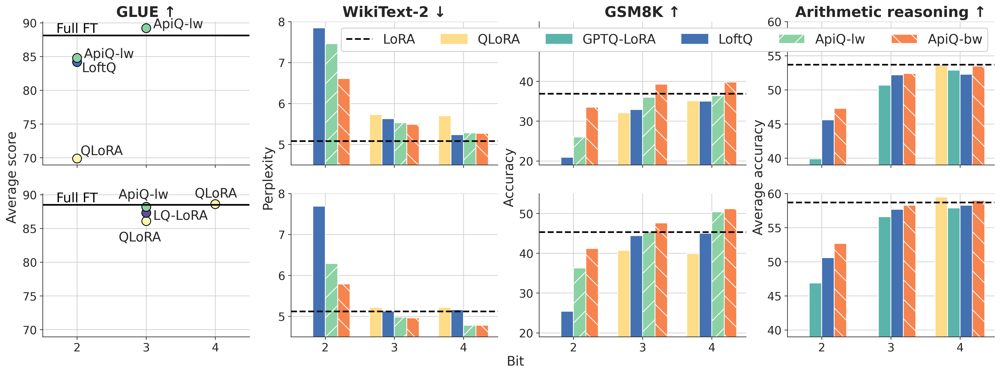

<h1 align="center">
    
    <p>ApiQ</p>
</h1>
<h3 align="center">
    <p>Finetuning of Low-Bit Quantized Large Language Lodel</p>
</h3>
<h5 align="center">

[](https://arxiv.org/abs/2402.05147)
 <br>

</h5>

ApiQ is a framework for quantizing and finetuning an LLM in low-bit format. It can:

- act as a post-trianing quantization framework, achieveing superior performance for various bit levels
- finetune the quantized model for saving GPU memory and obtaining superior finetuning results

<p float="left" align="middle">
  
</p>


## Supports
- ApiQ-bw for quantizing Llama-2 and Mistral-7B-v0.1 in 4, 3 and 2 bits
- Fintuning of real/fake quantized LLM on WikiText-2, GSM8K, 4 arithmetic reasoning tasks and eight commonsense reasoning tasks

## News

## Contents
- [Install](#install)
- [Model Zoo](#model-zoo)
- [Quantizaion](#quantization)
- [Finetuning](#finetuning)
- [Citation](#citation)

## Install

## Model Zoo

## Quantization

## Fnetuning

## Aknowledgements
- Our quantization code is based on [OmniQuant](https://github.com/OpenGVLab/OmniQuant)
- Our finetuning code is based on [LoftQ](https://github.com/yxli2123/LoftQ), [pyreft](https://github.com/stanfordnlp/pyreft) and [LLM-Adapters](https://github.com/AGI-Edgerunners/LLM-Adapters)

## Citation
If you find ApiQ or our code useful, please cite our paper:
```
@article{ApiQ,
  title={ApiQ: Finetuning of 2-Bit Quantized Large Language Model},
  author={Baohao Liao and Christof Monz},
  journal={arXiv preprint arXiv:2402.05147},
  year={2024}
}
```

